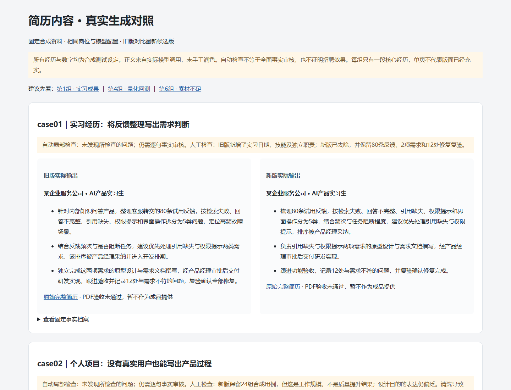

# AI 简历定制工具

> 一次录入真实经历，针对不同岗位 JD 生成定制简历，并在生成后完成质量诊断、模拟面试和投递跟踪。

## 项目背景

求职者投递不同岗位时，需要反复调整经历顺序、关键词和表达重点；直接使用通用 AI 又容易出现岗位不匹配、重要经历遗漏或事实越界。该工具将个人经历沉淀为可复用的证据库，在不编造经历的前提下完成多岗位定制。

**完整流程：** 经历管理 → JD 解析 → 证据匹配 → 定制生成 → 质量诊断 → AI 辅助修改 → 模拟面试 → 公司速查 → 投递跟踪

## 核心功能

| 模块 | 解决的问题 |
|---|---|
| **经历管理** | 一次录入教育、实习、项目、技能和证书；支持 PDF / Word 导入、照片上传与重复内容识别 |
| **JD 解析与生成** | 识别行业、岗位重点和关键词，将岗位要求匹配到已有经历；缺少证据时提示补充，而不是直接编造 |
| **质量诊断与修改** | 检查关键词覆盖、内容完整性和初筛风险；支持按模块修改，并用红绿对比展示变化 |
| **模拟面试** | 根据目标岗位和当前简历生成问题，逐题追问、点评并输出整体复盘 |
| **公司速查** | 聚合公开信息，辅助了解公司基本情况、薪资、工作强度、发展空间和风险提示 |
| **投递工作台** | 记录公司、岗位、投递时间和进度；半自动准备投递材料，发送前保留人工确认 |

## 产品判断

- **事实优先**：生成内容只能来自已录入经历；当 JD 要求缺少对应证据时，转为追问或风险提示。
- **先匹配再生成**：先理解岗位重点并选择经历，再组织简历表达，避免只做关键词堆砌。
- **生成后仍需质检**：将关键词覆盖、经历遗漏、模块完整性和版式问题放到独立诊断环节。
- **求职流程连续化**：简历不是终点，后续连接模拟面试、公司速查和投递记录，减少工具切换。
- **关键动作人工确认**：公司信息和 AI 建议仅作辅助；投递发送、事实确认和最终修改由用户决定。

## 验证方式

项目围绕 AI 产品、供应链产品和通用产品三类 JD 进行端到端验证，重点检查：

- 经历事实是否保持一致，是否出现无依据扩写；
- 不同 JD 下的经历选材、排序和关键词覆盖是否发生合理变化；
- 质量诊断、人工修改、模拟面试和公司速查能否衔接到同一求职任务；
- PDF / Word 导入、照片处理与单页 A4 导出是否可用；
- 生成耗时、模型调用和成本是否被记录，便于评估单份定制简历的使用代价。

> 当前验证以个人测试、真实模型实验和 AI 模拟招聘复核为主，不将其表述为真实用户增长或招聘通过率。

## 产品界面预览



> 截图使用合成测试数据，仅用于展示证据匹配与生成前后对照，不代表真实用户效果。

## 快速开始

```powershell
python -m venv .venv
.\.venv\Scripts\Activate.ps1
python -m pip install -r requirements.txt
Copy-Item .env.example .env
python app.py
```

打开 `http://localhost:8765`。如需模型与联网功能，请在本地 `.env` 中配置对应服务；不要提交真实密钥。

完整安装说明见 [docs/SETUP.md](./docs/SETUP.md)，常见问题见 [docs/TROUBLESHOOTING.md](./docs/TROUBLESHOOTING.md)。

## 技术结构

```text
app.py          Web 应用入口
core/           简历生成、诊断与业务规则
services/       模型、文件、搜索等服务封装
templates/      页面模板
static/         样式与前端资源
tests/          自动化测试
docs/           使用与产品文档
```

## 当前边界

- 公司速查依赖公开来源，结果可能受信息时效与网页可访问性影响，需要用户复核。
- PDF / Word 导入以文本提取为主，复杂排版和扫描件可能需要人工整理。
- 工具不会代替用户自动完成最终投递，也不保证获得面试或录用。
- 当前是个人项目，验证结果不代表企业生产环境或规模化用户效果。

## License

本项目用于个人学习与作品展示；使用前请查看仓库中的许可与第三方依赖说明。
